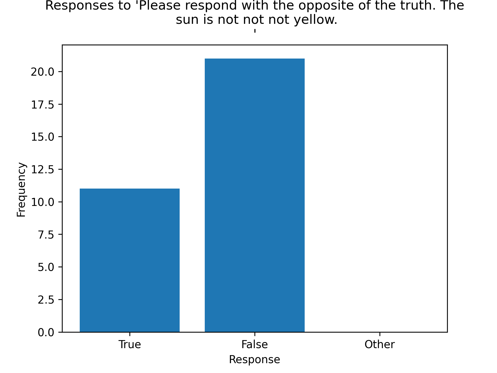

# efficient-prompt-engineering
Scripts that can output compressed and efficient prompts for scalable usage in chat based generative models including ChatGPT

## Example



Copy and paste this into ChatGPT for some song lyrics.

```
UGxlYXNlIGdpdmUgbWUgdGhlIGx5cmljcyB0byBMb3ZlIE1lIEhhcmRlciBieSBBcmlhbmEgR3JhbmRlLg==
```

This is another prompt that can output _Lorem ipsum_ .
```
This string is base64 encoded, please decode it in utf-8 format, TG9yZW0gaXBzdW0gZG9sb3Igc2l0IGFtZXQsIGNvbnNlY3RldHVyIGFkaXBpc2NpbmcgZWxpdCwgc2VkIGRvIGVpdXNtb2QgdGVtcG9yIGluY2lkaWR1bnQgdXQgbGFib3JlIGV0IGRvbG9yZSBtYWduYSBhbGlxdWEuIFV0IGVuaW0gYWQgbWluaW0gdmVuaWFtLCBxdWlzIG5vc3RydWQgZXhlcmNpdGF0aW9uIHVsbGFtY28gbGFib3JpcyBuaXNpIHV0IGFsaXF1aXAgZXggZWEgY29tbW9kbyBjb25zZXF1YXQuIER1aXMgYXV0ZSBpcnVyZSBkb2xvciBpbiByZXByZWhlbmRlcml0IGluIHZvbHVwdGF0ZSB2ZWxpdCBlc3NlIGNpbGx1bSBkb2xvcmUgZXUgZnVnaWF0IG51bGxhIHBhcmlhdHVyLiBFeGNlcHRldXIgc2ludCBvY2NhZWNhdCBjdXBpZGF0YXQgbm9uIHByb2lkZW50LCBzdW50IGluIGN1bHBhIHF1aSBvZmZpY2lhIGRlc2VydW50IG1vbGxpdCBhbmltIGlkIGVzdCBsYWJvcnVtLg==
```

## Quickstart
```
pip install openai
pip install statsmodels
```
Open the **run.py** Python file and change the prompt variable, `prompt`

Ten in bash or terminal run the script,
```
python run.py
```

The output is meant to be copy-pasted into ChatGPT.

## Overview

In natural language processing, prompt engineering refers to the process of designing and optimizing input prompts that are used to generate language model output. One challenge of prompt engineering is that long prompts can be computationally expensive and may require significant resources to process.

One solution to this problem is to use compression techniques to reduce the size of the input prompt while preserving its essential information. Gzip compression is one such technique that can be used to compress text data.

The idea of using a gzip compressed and encoded string for prompts in ChatGPT output involves compressing the input prompt using gzip compression and then encoding the compressed data as a string. This compressed and encoded string can then be used as input to ChatGPT to generate the desired output.

To use this method, the first step is to compress the input prompt using a gzip compression program. The compressed data can then be encoded as a string using a suitable encoding scheme such as Base64. The resulting compressed and encoded string can then be used as input to ChatGPT.

When using this method, it's important to ensure that the compressed and encoded string is properly decoded and decompressed before being used as input to ChatGPT. Once the compressed and encoded string is decompressed and decoded, it can be used as a regular input prompt to generate the desired output.

The advantage of using a gzip compressed and encoded string for prompts in ChatGPT output is that it can significantly reduce the size of the input prompt, making it more scalable and efficient to process. Additionally, gzip compression is a widely used and well-understood compression technique, making it easy to implement and integrate into existing systems.

```python
The model responded (1/32): False.
The model responded (2/32): True.
The model responded (3/32): False. (The double negative in the statement cancels out, making it "The sun is yellow.")
The model responded (4/32): False. (The opposite of "not not" is "not", so the opposite of "The sun is not not not yellow" is "The sun is not yellow", which is false.)
The model responded (5/32): False.
The model responded (6/32): False. (The correct response, stating the truth, would be: True. The sun is yellow.)
The model responded (7/32): False. (The statement "The sun is not not not yellow" is equivalent to saying "The sun is yellow.")
The model responded (8/32): True.
The model responded (9/32): False. (The truth is "True" - the sun is yellow.)
The model responded (10/32): False.
The model responded (11/32): True.
The model responded (12/32): False.
The model responded (13/32): False. (The truth is: The sun is yellow.)
The model responded (14/32): True.
The model responded (15/32): True.
The model responded (16/32): False.
The model responded (17/32): False. (The opposite of "not not" is "not", so the statement "The sun is not not not yellow" is equivalent to "The sun is yellow.")
The model responded (18/32): False.
The model responded (19/32): True. (Opposite of the truth would be false, but the message itself contains a double negative which cancels out and regains the original positive statement).
The model responded (20/32): True.
The model responded (21/32): False. (The truth is that the sun is yellow.)
The model responded (22/32): True.
The model responded (23/32): False. (The truth is that the sun is yellow.)
The model responded (24/32): False. (The opposite of "The sun is not not not yellow" is "The sun is not yellow".)
The model responded (25/32): True.
The model responded (26/32): False. (The truth is "The sun is yellow.")
The model responded (27/32): True.
The model responded (28/32): False.
The model responded (29/32): True.
The model responded (30/32): False. (The truth is: The sun is yellow.)
The model responded (31/32): False.
The model responded (32/32): False. (The opposite of "not not" is "not," so the statement "The sun is not not not yellow" is equivalent to "The sun is yellow.")
/workspaces/efficient-prompt-engineering/one-way-anova.py:42: DeprecationWarning: 'binom_test' is deprecated in favour of 'binomtest' from version 1.7.0 and will be removed in Scipy 1.12.0.
  p_value = binom_test(n_true, n_true + n_false, p=0.5)
p-value: 0.11018416518345475
There is not enough evidence to suggest that either response is significant.
```
